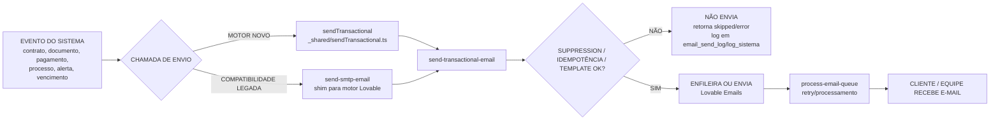

# Diagrama completo — Área do Cliente, contratos, documentos e disparos

Base legal operacional do sistema Quero Armas: Lei 10.826/2003, Decreto 11.615/2023, Decreto 12.345/2024, Instruções Normativas DG/PF 201 e 311.

Este documento mapeia o fluxo observado no código em 22/07/2026. O objetivo é mostrar tudo que acontece quando o cliente envia ou não envia documentos, incluindo contrato, liberação de serviço, checklist, Hub de Documentos, IA, reaproveitamento, status e disparos de e-mail/notificação.

## Diagrama geral

```mermaid
flowchart TD
  START["CLIENTE ENTRA NA ÁREA DO CLIENTE<br/>/area-do-cliente"]
  AUTH{"USUÁRIO AUTENTICADO?"}
  LOGIN["LOGIN / OTP / CREDENCIAIS<br/>cliente-portal-request-otp<br/>cliente-portal-verify-otp<br/>ensure-client-access"]
  LOAD["PORTAL CARREGA DADOS<br/>qa_clientes, qa_vendas, qa_contracts,<br/>qa_processos, qa_processo_documentos,<br/>qa_documentos_cliente"]

  START --> AUTH
  AUTH -- "NÃO" --> LOGIN --> LOAD
  AUTH -- "SIM" --> LOAD

  LOAD --> PENDING_CONTRACT{"EXISTE CONTRATO PENDENTE?"}
  PENDING_CONTRACT -- "SIM" --> CONTRACT_CARD["CARD CONTRATOS PÓS-PAGAMENTO<br/>ContratosPosPagamentoCard"]
  PENDING_CONTRACT -- "NÃO" --> CHECK_PROCESS

  CONTRACT_CARD --> DOWNLOAD["ABRIR / BAIXAR CONTRATO<br/>openMinutaContratoQueroArmas<br/>qa-contrato-view-public / qa-serve-contract-pdf"]
  CONTRACT_CARD --> UPLOAD_CONTRACT{"CLIENTE ENVIA CONTRATO ASSINADO?"}
  UPLOAD_CONTRACT -- "NÃO" --> BLOCK_SERVICE["SERVIÇO CONTINUA BLOQUEADO<br/>status: pending_customer_signature<br/>ou generated_pending_company_signature<br/>ARSENAL GRATUITO NÃO É BLOQUEADO"]
  UPLOAD_CONTRACT -- "SIM" --> SIGNED_UPLOAD["UPLOAD DO PDF ASSINADO<br/>qa-upload-signed-contract"]

  SIGNED_UPLOAD --> VALIDATE_SIGN["VALIDAÇÃO ASSINATURA<br/>qa-validate-customer-signature<br/>qa-validate-govbr-signature"]
  VALIDATE_SIGN --> SIGN_DECISION{"ASSINATURA VÁLIDA?"}
  SIGN_DECISION -- "NÃO" --> CONTRACT_REJECT["qa_contracts.status = rejected<br/>template: contrato-recusado<br/>cliente reenviará PDF"]
  SIGN_DECISION -- "REVISÃO" --> CONTRACT_REVIEW["qa_contracts.status = pending_manual_review<br/>equipe confere"]
  SIGN_DECISION -- "SIM" --> CONTRACT_VALIDATED["qa_contracts.status = validated<br/>evento: contrato validado"]

  CONTRACT_VALIDATED --> RELEASE["LIBERAÇÃO OPERACIONAL<br/>qa-liberar-servicos-contrato"]
  RELEASE --> PAYCHECK{"VENDA PAGA E COBRANÇA CONFIRMADA?"}
  PAYCHECK -- "NÃO" --> RELEASE_SKIP["LIBERAÇÃO RECUSADA<br/>eventos em qa_contract_events"]
  PAYCHECK -- "SIM" --> SERVICE_REQUEST["CRIA/REUSA SOLICITAÇÃO<br/>qa_solicitacoes_servico<br/>status_servico = aguardando_documentacao"]
  SERVICE_REQUEST --> CATALOG{"SERVIÇO GERA PROCESSO?"}
  CATALOG -- "NÃO" --> SERVICE_ONLY["SERVIÇO LIBERADO SEM PROCESSO<br/>evento: servico_liberado_por_contrato_validado"]
  CATALOG -- "SIM" --> PROCESS_CREATE["CRIA/REUSA qa_processos<br/>status inicial: aguardando_pagamento<br/>depois aguardando_documentos"]
  PROCESS_CREATE --> CHECKLIST_EXPLODE["EXPLODE CHECKLIST<br/>RPC qa_confirmar_pagamento_processo<br/>qa_explodir_checklist_processo<br/>qa_processo_documentos"]
  CHECKLIST_EXPLODE --> AUTO_POPUP["CHECKLIST GUIADO AUTOABRE<br/>ChecklistGuiado + Realtime<br/>se houver pendências"]

  CHECK_PROCESS{"HÁ PROCESSOS / DOCUMENTOS PENDENTES?"}
  CHECK_PROCESS -- "NÃO" --> DASH_OK["PORTAL MOSTRA TUDO EM DIA<br/>sem popup obrigatório"]
  CHECK_PROCESS -- "SIM" --> AUTO_POPUP
  BLOCK_SERVICE --> CHECK_PROCESS

  AUTO_POPUP --> REVIEW_REQ["REVISÃO DAS EXIGÊNCIAS<br/>qa_processo_rever_exigencias<br/>tenta marcar reaproveitados do Hub"]
  REVIEW_REQ --> QUEUE["MONTA FILA DO ASSISTENTE<br/>documentos pendentes, inválidos,<br/>divergentes, perguntas e em análise"]
  QUEUE --> ITEM_KIND{"ITEM DA FILA"}

  ITEM_KIND -- "PERGUNTA / CONDIÇÃO" --> ANSWER["CLIENTE RESPONDE<br/>qa-processo-responder-pergunta<br/>ou qa-processo-set-condicao"]
  ANSWER --> RELOAD_QUEUE["RECARREGA CHECKLIST"]

  ITEM_KIND -- "DOCUMENTO PERMANENTE / HUB" --> HUB_MODAL["ABRE HUB DE DOCUMENTOS<br/>ClienteDocsHubModal<br/>qa_documentos_cliente"]
  ITEM_KIND -- "DOCUMENTO DO PROCESSO" --> PROCESS_DOC["UPLOAD DO ITEM DO CHECKLIST<br/>qa_processo_documentos"]
  ITEM_KIND -- "DOCUMENTO DE ARMA" --> ARM_DOC["HUB / VÍNCULO COM ARMA<br/>arma_id, série, CRAF, SINARM, SIGMA"]

  HUB_MODAL --> HUB_UPLOAD{"CLIENTE ENVIA DOCUMENTO NO HUB?"}
  HUB_UPLOAD -- "NÃO" --> HUB_PENDING["DOCUMENTO CONTINUA AUSENTE/PENDENTE<br/>assistente não avança este item"]
  HUB_UPLOAD -- "SIM" --> HUB_CLASSIFY["CLASSIFICA / EXTRAI<br/>qa-classificar-documento-arma<br/>qa-extract-cliente-doc<br/>qa-conformidade-semantica"]
  HUB_CLASSIFY --> HUB_SAVE["SALVA qa_documentos_cliente<br/>status aprovado, pendente_aprovacao,<br/>revisao_humana ou outro conforme resultado"]
  HUB_SAVE --> REUSE_TRY["TENTA REAPROVEITAR NO PROCESSO<br/>qa_processo_rever_exigencias<br/>qa-processo-doc-reaproveitar"]

  PROCESS_DOC --> STORAGE["FRONT SOBE ARQUIVO NO STORAGE<br/>bucket qa-processo-docs"]
  STORAGE --> DOC_UPLOAD_EDGE["REGISTRA UPLOAD<br/>qa-processo-doc-upload"]
  DOC_UPLOAD_EDGE --> PRECHECK{"PRÉ-CHECK OK?<br/>formato, tamanho, arquivo existe"}
  PRECHECK -- "NÃO" --> INVALID_PRE["qa_processo_documentos.status = invalido<br/>evento: upload_bloqueado_*<br/>notificação: documento_invalido"]
  PRECHECK -- "SIM" --> SPECIAL_CERT{"É CERTIDÃO AVERBADA<br/>PARA DIVERGÊNCIA DE NOME?"}
  SPECIAL_CERT -- "SIM" --> REDIRECT_CERT["CRIA/USA PENDÊNCIA CERTIDÃO<br/>tipo certidao_alteracao_nome<br/>evento: upload_certidao_redirecionado"]
  SPECIAL_CERT -- "NÃO" --> MARK_ANALYSIS
  REDIRECT_CERT --> MARK_ANALYSIS["status = em_analise<br/>validacao_ia_status = fila"]
  MARK_ANALYSIS --> NOTIF_VALIDATING["notificação: documento_em_validacao<br/>qa-processo-notificar"]
  MARK_ANALYSIS --> IA["VALIDAÇÃO IA<br/>qa-processo-doc-validar-ia<br/>Lovable AI Gateway / Gemini"]

  IA --> IA_FAIL{"IA FALHOU OU NÃO LEU?"}
  IA_FAIL -- "SIM" --> HUMAN_REVIEW["status = revisao_humana<br/>validacao_ia_status = erro/revisao_humana<br/>notificação: revisao_humana"]
  IA_FAIL -- "NÃO" --> IA_DECISION{"DECISÃO IA"}

  IA_DECISION -- "CONF >= 0.90<br/>SEM DIVERGÊNCIA<br/>SEM CAMPO FALTANDO" --> DOC_APPROVED["status = aprovado<br/>decisao_ia = aprovado_auto<br/>notificação: documento_aprovado"]
  IA_DECISION -- "CONF 0.70-0.89<br/>OU INCERTEZA" --> HUMAN_REVIEW
  IA_DECISION -- "CONF < 0.70<br/>ILEGÍVEL<br/>TIPO ERRADO<br/>CAMPO CRÍTICO FALTANDO<br/>VENCIDO/ESPERADO NÃO BATE" --> DOC_INVALID["status = invalido<br/>notificação: documento_invalido"]
  IA_DECISION -- "DIVERGÊNCIA DE DADOS" --> DOC_DIVERGENT["status = divergente<br/>notificação: divergencia_dados<br/>cliente/equipe resolve"]
  IA_DECISION -- "DOCUMENTO INCOMPATÍVEL" --> DOC_INCOMPAT["template: documento-incompativel-processo<br/>sendTransactional"]

  DOC_APPROVED --> POST_APPROVAL["PÓS-APROVAÇÃO<br/>dispensa grupo quando aplicável<br/>atualiza campos extraídos<br/>registra eventos"]
  HUMAN_REVIEW --> TEAM_ACTION["EQUIPE APROVA / REPROVA / PEDE REENVIO<br/>admin ações sobre qa_processo_documentos"]
  DOC_INVALID --> CLIENT_RESEND["CLIENTE PRECISA REENVIAR"]
  DOC_DIVERGENT --> RESOLVE_DIV["CLIENTE CONFIRMA CADASTRO OU DOCUMENTO<br/>ou envia certidão/novo arquivo"]
  DOC_INCOMPAT --> CLIENT_RESEND
  INVALID_PRE --> CLIENT_RESEND

  TEAM_ACTION --> CHECK_DONE
  POST_APPROVAL --> CHECK_DONE
  REUSE_TRY --> CHECK_DONE
  RELOAD_QUEUE --> CHECK_DONE
  CLIENT_RESEND --> QUEUE
  RESOLVE_DIV --> QUEUE
  HUB_PENDING --> QUEUE

  CHECK_DONE["CHECA CONCLUSÃO<br/>qa-processo-checar-conclusao-checklist"]
  CHECK_DONE --> ALL_DONE{"TODAS AS EXIGÊNCIAS VISÍVEIS<br/>CUMPRIDAS E PAGAMENTO CONFIRMADO?"}
  ALL_DONE -- "NÃO: FALTA DOC" --> KEEP_PENDING["MANTÉM STATUS DO PROCESSO<br/>aguardando_documentos / pendente_cliente / em_validacao"]
  ALL_DONE -- "NÃO: EM ANÁLISE" --> WAIT_TEAM["AGUARDA IA OU EQUIPE"]
  ALL_DONE -- "SIM" --> READY["qa_processos.status = pronto_para_protocolar<br/>evento: processo_pronto_para_protocolar"]

  READY --> EMAIL_CLIENT["E-MAIL CLIENTE<br/>template: documentacao-completa<br/>idempotencyKey pronto-proto-cli-*"]
  READY --> EMAIL_TEAM["E-MAIL EQUIPE<br/>template: processo-pronto-protocolar<br/>idempotencyKey pronto-proto-team-*"]
  EMAIL_CLIENT --> DONE["CLIENTE ACOMPANHA PRÓXIMA ETAPA<br/>Área do Cliente"]
  EMAIL_TEAM --> ADMIN_FOLLOW["EQUIPE PROTOCOLA NO ÓRGÃO"]
```

## Subfluxo de e-mail transacional

## Matriz dos principais disparos

| Momento | Quem dispara | Template/evento | Destinatário | Idempotência / observação |
|---|---|---|---|---|
| Acesso liberado ao portal | criação/provisionamento de acesso | `acesso-liberado-portal`, `credenciais-portal`, `boas-vindas` | Cliente | Fluxo de acesso ao portal |
| Contrato pronto | geração/assinatura da empresa | `contrato-pronto-assinatura` | Cliente | Link público do contrato |
| Contrato regenerado | painel admin | `contrato-regenerado-assinatura` | Cliente | Deve usar `arsenalinteligente@notificacao.euqueroarmas.com.br` via motor transacional |
| Contrato assinado/validado | upload e validação do contrato | `contrato-assinado` ou eventos de contrato | Cliente/equipe conforme fluxo | Liberação operacional só após `qa_contracts.status = validated` |
| Contrato recusado | validação de assinatura falha | `contrato-recusado` | Cliente | Cliente precisa reenviar PDF assinado |
| Upload de documento recebido | `qa-processo-doc-upload` | `documento_em_validacao` | Cliente | Arquivo aceito no pré-check e enviado à IA |
| Formato/tamanho inválido | `qa-processo-doc-upload` | `documento_invalido` | Cliente | Bloqueia antes da IA |
| IA aprova | `qa-processo-doc-validar-ia` | `documento_aprovado` | Cliente | Depois chama checagem de conclusão |
| IA não lê / baixa confiança intermediária | `qa-processo-doc-validar-ia` | `revisao_humana` | Cliente | Equipe precisa conferir |
| IA reprova | `qa-processo-doc-validar-ia` | `documento_invalido` | Cliente | Cliente reenvia |
| Divergência de dados | `qa-processo-doc-validar-ia` | `divergencia_dados` | Cliente | Cliente confirma cadastro/documento ou reenvia |
| Documento incompatível com processo | `qa-processo-doc-validar-ia` | `documento-incompativel-processo` | Cliente | Envio transacional direto |
| Checklist 100% cumprido | `qa-processo-checar-conclusao-checklist` | `documentacao-completa` | Cliente | `idempotencyKey = pronto-proto-cli-{processoId}` |
| Checklist 100% cumprido | `qa-processo-checar-conclusao-checklist` | `processo-pronto-protocolar` | Equipe | `idempotencyKey = pronto-proto-team-{processoId}` |

## Estados principais

### `qa_contracts.status`

| Status | Significado operacional |
|---|---|
| `generated_pending_company_signature` | Contrato gerado, ainda não pronto para assinatura do cliente |
| `pending_customer_signature` | Contrato disponível e aguardando assinatura do cliente |
| `customer_signature_uploaded` | Cliente enviou PDF assinado |
| `validating` | Assinatura em validação |
| `validated` | Contrato validado; libera serviços/processos |
| `rejected` | Contrato recusado; cliente precisa reenviar |
| `pending_manual_review` | Equipe precisa revisar manualmente |

### `qa_processo_documentos.status`

| Status | Quem vê o quê |
|---|---|
| `pendente` | Cliente ainda precisa enviar |
| `em_analise`, `fila`, `processando`, `enviado` | Cliente aguarda IA/equipe |
| `aprovado`, `validado`, `concluido` | Item cumprido |
| `revisao_humana`, `pendente_aprovacao`, `aguardando_equipe` | Equipe precisa agir |
| `invalido`, `divergente`, `reprovado` | Cliente precisa corrigir, confirmar ou reenviar |
| `dispensado`, `dispensado_grupo`, `dispensado_por_reaproveitamento`, `hub_reaproveitado`, `nao_aplicavel` | Item não precisa de novo envio |

### `qa_processos.status`

| Status | Significado |
|---|---|
| `aguardando_pagamento` | Processo criado, mas pagamento ainda não confirmado |
| `aguardando_assinatura` | Pagamento ok, contrato ainda pendente |
| `aguardando_documentos`, `documentos_pendentes`, `em_documentacao`, `pendente_cliente` | Cliente ainda tem ação documental |
| `em_validacao`, `revisao_humana` | IA/equipe validando |
| `pronto_para_protocolar` | Checklist cumprido; equipe pode protocolar |

## Pontos de atenção do fluxo

1. Se o cliente não envia o contrato assinado, o serviço contratado não é liberado para execução operacional. O Arsenal Inteligente gratuito não deve ser bloqueado por isso.
2. Se o cliente não envia documentos do checklist, o assistente continua apontando pendências e `qa-processo-checar-conclusao-checklist` não promove o processo.
3. Se o cliente envia arquivo inválido por formato/tamanho, o bloqueio acontece antes da IA e dispara notificação de reenvio.
4. Se a IA não consegue ler com segurança, o sistema vai para revisão humana, nunca aprova por presunção.
5. Se o documento já existe no Hub e é compatível, aprovado, não vencido e reaproveitável, o destino pode virar `dispensado_por_reaproveitamento`.
6. A conclusão do checklist é idempotente: depois de registrar `pronto_para_protocolar_enviado_em`, não deve reenviar os e-mails de documentação completa.
7. O motor oficial de e-mail é o Lovable transactional email, com `sendTransactional` e `send-transactional-email`; `send-smtp-email` é shim legado.

